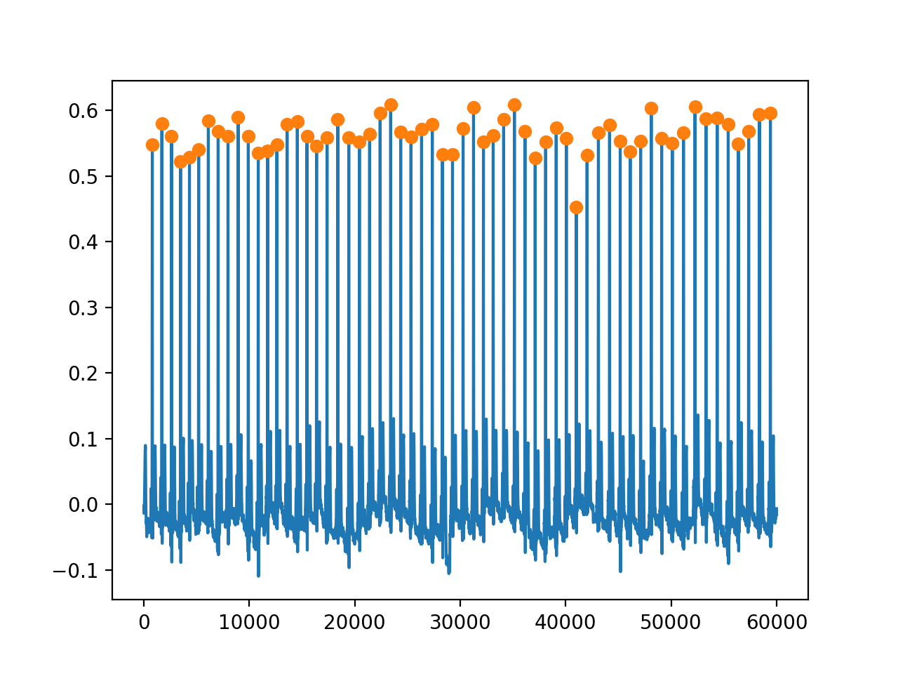
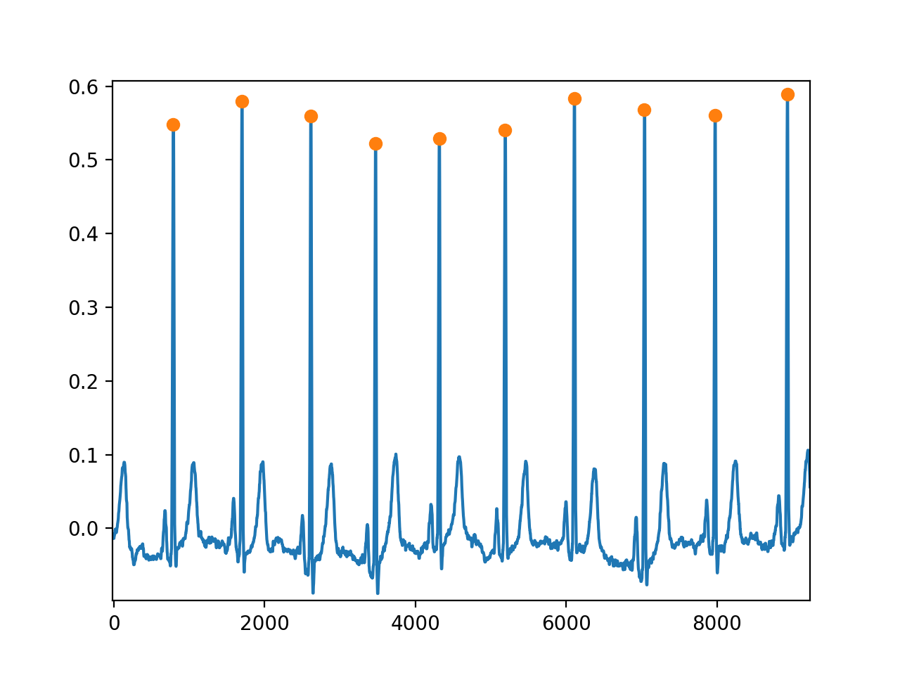
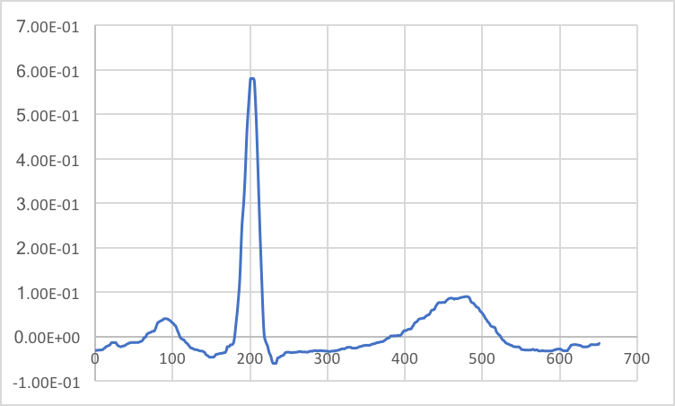

# Making_ECG_BasicWave

心電図波形(ECG)から心電図の基本波形をそれぞれ抽出する処理  
R波を探し出すことで「そこから前後に何点の区間を抽出」というアプローチ

前処理としてトレンド除去、ノイズ除去を行なっている。  
次にR波をピッキングし、そこから前200点、後450点の合計651点を抽出することで基本波形を取りだした。  
R波をピッキングする際には「振幅の閾値」、及び「ピーク間隔の閾値」を情報として設定した。

ここでは1人の健常者の12誘導心電図の"I","II"誘導のみを扱っている。  
使用した心電図データは以下URLである。  
https://physionet.org/physiobank/database/ptbdb/


使用言語: python3  
以下必要ライブラリ
```
pip3 install numpy
pip3 install scipy
pip3 install matplotlib
```

実行する際は  
`python3 Make_BasicWave`  

"Health_Basic"のディレクトリ内に"I"誘導用と"II"誘導用のディレクトリ(それぞれ"0"および"1"に対応)があり、その中に心電図の基本波形がそれぞれcsvファイルで出力される。  

下図はプロットするコメントアウトを外した時の図である。
青線はトレンド除去、ノイズ除去を行なった後の波形であり、オレンジ丸はR波としてピッキングした点を示す。


さらに下図は上図を拡大したものである。  


最後に次の図は上図より抽出された基本波形の例を示す。

